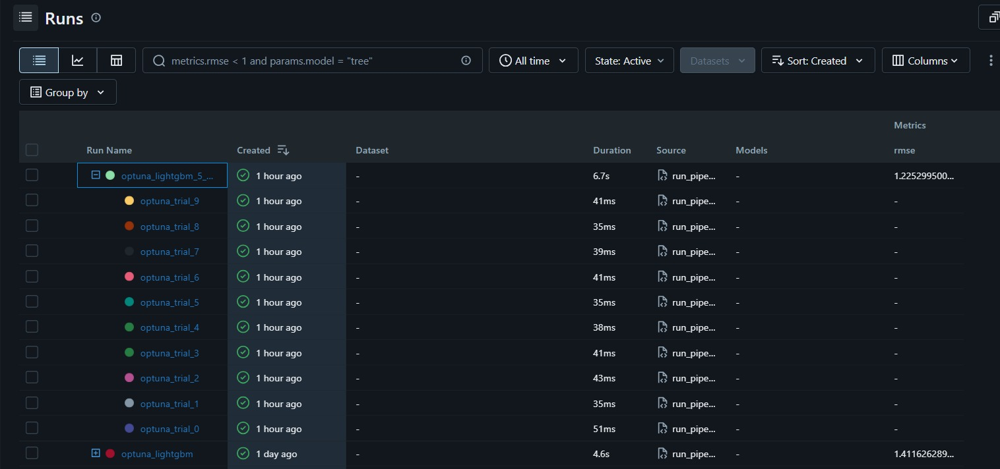
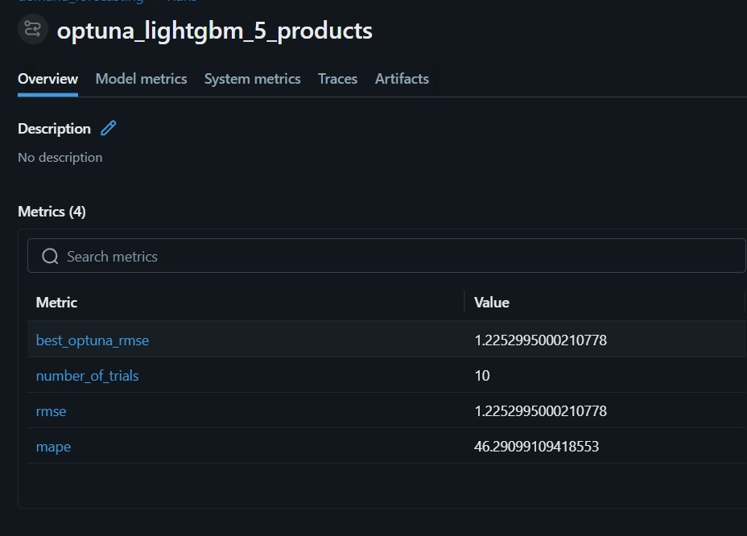
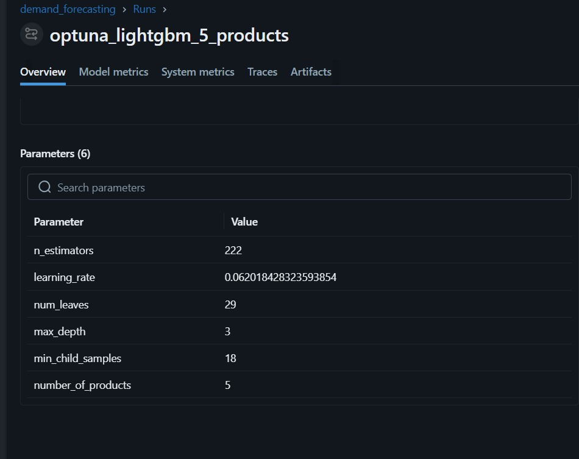
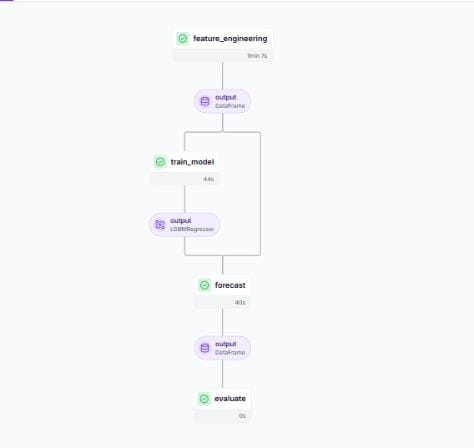
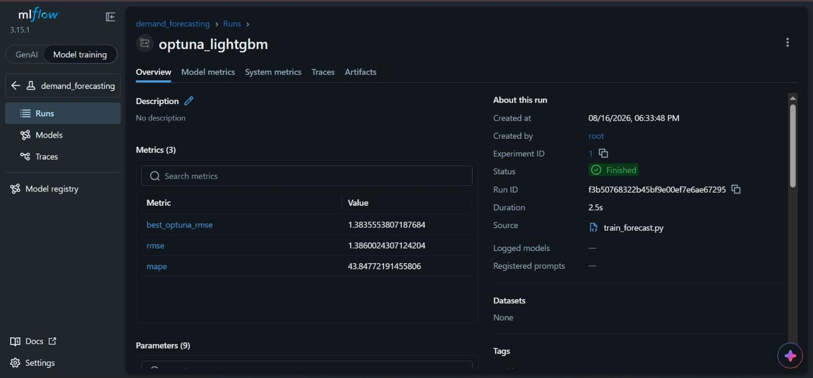

# Demand Forecasting MLOps

## Problem Statement

Demand forecasting is an important task in retail and e-commerce because accurate demand predictions can help businesses improve inventory planning and support better decision-making.

This project focuses on building a machine learning-based demand forecasting system using the M5 retail sales dataset. The project applies MLOps practices to make the forecasting workflow reproducible, track experiments, optimize model hyperparameters, and organize the complete machine learning workflow.

## Objective

The main objective of this project is to develop a demand forecasting pipeline using the M5 retail sales dataset and apply MLOps practices for reproducible model development and experiment tracking.

The project aims to:

- Perform time-series feature engineering using lag and rolling features.
- Train a LightGBM gradient-boosting model for demand forecasting.
- Optimize LightGBM hyperparameters using Optuna.
- Forecast demand for multiple products.
- Track model parameters and evaluation metrics such as RMSE and MAPE using MLflow.
- Orchestrate the workflow using ZenML.
- Maintain the project code and documentation using GitHub.

## Dataset

This project uses the **M5 Forecasting — Accuracy** dataset from Kaggle, which contains hierarchical daily sales data from Walmart.

The project uses the M5 data to perform time-series feature engineering and demand forecasting for **5 selected products**.

The required M5 dataset files are stored in the `data/` directory.

## Products Used

The forecasting workflow was revised to forecast demand for **5 products** from the M5 dataset.

The model configuration records the number of products as:

```text
number_of_products = 5
```

## Tools Used

This project uses the following MLOps tools:

| Tool               | Purpose                                 |
| ------------------ | --------------------------------------- |
| **LightGBM**       | Demand forecasting model                |
| **Optuna**         | Hyperparameter optimization             |
| **ZenML**          | Pipeline orchestration                  |
| **MLflow**         | Experiment tracking and metric logging  |
| **Python**         | Data processing and model development   |
| **Pandas / NumPy** | Data processing and feature engineering |
| **GitHub**         | Version control and project repository  |


## Project Architecture

The demand forecasting workflow is organized as a ZenML pipeline. The pipeline performs feature engineering, model training, forecasting, and evaluation.

### Pipeline Flow

M5 Dataset
     ↓
Feature Engineering
(Lag & Rolling Features)
     ↓
Model Training
(LightGBM + Optuna)
     ↓
Forecasting
     ↓
Evaluation
(RMSE & MAPE)
     ↓
MLflow Experiment Tracking


## Project Structure

```text
demand-forecasting-mlops/
│
├── data/
│   ├── calendar.csv
│   ├── sales_train_evaluation.csv
│   └── sell_prices.csv
│
├── models/
│   └── forecast_model.pkl
│
├── steps/
│   ├── feature_engineering.py
│   ├── train_model.py
│   ├── forecast.py
│   └── evaluate.py
│
├── pipelines/
│   └── forecast_pipeline.py
│
├── run_pipeline.py
├── requirements.txt
├── .gitignore
└── README.md
```

## Feature Engineering

The feature engineering stage prepares the historical sales data for demand forecasting.

The pipeline creates time-series features that help the model learn patterns from previous demand observations.

The main features include:

- **Lag features** — use previous sales observations as input features.
- **Rolling features** — calculate statistics over previous observations to capture demand trends.

The engineered features are then passed to the LightGBM model for training and forecasting.

## Model

The project uses **LightGBM (Light Gradient Boosting Machine)** as the demand forecasting model.

LightGBM is a gradient-boosting framework that builds decision trees sequentially. Each new tree attempts to reduce the errors produced by the previous trees.

The model is trained using the engineered time-series features generated during the feature engineering stage, including lag, rolling, and calendar-based features.

The model is evaluated using:

- **RMSE (Root Mean Squared Error)**
- **MAPE (Mean Absolute Percentage Error)**

The mathematical optimization process used by LightGBM is described in the **Mathematics Behind LightGBM** section below.

## Mathematics Behind LightGBM

LightGBM is based on gradient boosting, where multiple decision trees are built sequentially. Each new tree attempts to reduce the errors made by the previous trees.

For a training dataset with observations $$\(x_i\)$$ and actual target values $$\(y_i\)$$, the prediction is updated when a new tree is added:

```math
\hat{y}_i^{(t)} = \hat{y}_i^{(t-1)} + f_t(x_i)
```

where:

- $$\(y_i\)$$ represents the actual value.
- $$\(\hat{y}_i^{(t-1)}\)$$ represents the prediction from the previous boosting iteration.
- $$\(f_t(x_i)\)$$ represents the new decision tree.
- $$\(\hat{y}_i^{(t)}\)$$ represents the updated prediction.
- $$\(t\)$$ represents the current boosting iteration.

### Objective Function

At each boosting iteration, LightGBM minimizes an objective function consisting of the training loss and a regularization term:

```math
Obj^{(t)} =
\sum_{i=1}^{n} L(y_i,\hat{y}_i^{(t)}) + \Omega(f_t)
```

where:

- $$\(y_i\)$$ is the actual value.
- $$\(\hat{y}_i^{(t)}\)$$ is the predicted value.
- $$\(L\)$$ is the loss function.
- $$\(\Omega(f_t)\)$$ is the regularization term that controls the complexity of the new tree.

### Second-Order Taylor Approximation

LightGBM uses the first and second derivatives of the loss function to efficiently optimize each new tree.

For each observation:

```math
g_i =
\frac{\partial L(y_i,\hat{y}_i)}
{\partial \hat{y}_i}
```

```math
h_i =
\frac{\partial^2 L(y_i,\hat{y}_i)}
{\partial \hat{y}_i^2}
```

where:

- $$\(g_i\)$$ is the gradient (first derivative).
- $$\(h_i\)$$ is the Hessian (second derivative).

Using the second-order Taylor approximation, the objective for a new tree can be approximated using these gradients and Hessians.

### Leaf Weight

For a leaf containing a set of observations $$\(I_j\)$$, the optimal leaf value can be obtained using the sum of gradients and Hessians:

```math
w_j^* =
-\frac{\sum_{i\in I_j} g_i}
{\sum_{i\in I_j} h_i + \lambda}
```

where:

- $$\(w_j^*\)$$ is the optimal value of the leaf.
- $$\(g_i\)$$ is the gradient.
- $$\(h_i\)$$ is the Hessian.
- $$\(\lambda\)$$ is the L2 regularization parameter.
- $$\(\sum_{i\in I_j} g_i\)$$ represents the total gradient in the leaf.
- $$\(\sum_{i\in I_j} h_i\)$$ represents the total Hessian in the leaf.

### Choosing a Split

LightGBM evaluates possible feature splits by calculating the improvement in the objective function.

For a split into left and right child nodes, the split gain can be represented as:

```math
Gain =
\frac{1}{2}
\left(
\frac{G_L^2}{H_L+\lambda}
+
\frac{G_R^2}{H_R+\lambda}
-
\frac{G^2}{H+\lambda}
\right)
```

where:

```math
G_L = \sum_{i\in L} g_i,
\qquad
G_R = \sum_{i\in R} g_i
```

and:

```math
H_L = \sum_{i\in L} h_i,
\qquad
H_R = \sum_{i\in R} h_i
```

Here:

- $$\(G_L\)$$ and $$\(G_R\)$$ are the sums of gradients in the left and right child nodes.
- $$\(H_L\)$$ and $$\(H_R\)$$ are the sums of Hessians in the left and right child nodes.
- $$\(\lambda\)$$ is the L2 regularization parameter.

A split that produces a larger gain provides a greater improvement in the objective and is therefore preferred.

### LightGBM Tree Growth

Unlike traditional level-wise tree growth, LightGBM uses **leaf-wise tree growth**. At each step, it selects the leaf that provides the largest reduction in the objective function and splits that leaf.

This allows LightGBM to reduce the loss efficiently while building relatively complex trees.

For this project, LightGBM uses the engineered time-series features to learn relationships between historical demand patterns and future demand.

## Hyperparameter Optimization with Optuna

Optuna is used to optimize the hyperparameters of the LightGBM model.

Optuna automatically explores different combinations of hyperparameters and evaluates their performance to identify a better configuration for the forecasting model.

The optimization process follows these steps:

1. Define the hyperparameter search space.
2. Generate a trial with a set of hyperparameters.
3. Train the LightGBM model using the selected parameters.
4. Evaluate the trial using RMSE.
5. Repeat the process for multiple trials.
6. Select the best-performing hyperparameter configuration.
7. Use the optimized configuration for the forecasting workflow.

The current experiment uses:
 Number of trials = 10
 Number of products = 5

### Optuna Trial Comparison

The Optuna optimization was performed using 10 trials. Each trial used a different combination of LightGBM hyperparameters and was evaluated using RMSE.

The MLflow comparison below shows the relationship between the LightGBM learning rate and the RMSE obtained across the 10 Optuna trials. Lower RMSE indicates better forecasting performance.


## Best Hyperparameters

The best-performing configuration recorded in MLflow is:

| Parameter            | Value                |
| -------------------- | -------------------- |
| `n_estimators`       | 222                  |
| `learning_rate`      | 0.062018428323593854 |
| `num_leaves`         | 29                   |
| `max_depth`          | 3                    |
| `min_child_samples`  | 18                   |
| `number_of_products` | 5                    |


## MLflow Experiment Tracking

MLflow is used to track the experiments performed during model development.

The experiment records:

- Model hyperparameters
- Number of Optuna trials
- Number of products
- RMSE
- MAPE
- Optuna trial runs

The final MLflow experiment is named:
 optuna_lightgbm_5_products

## MLflow Results

The final experiment recorded the following metrics:

| Metric                  | Value  |
| ----------------------- | ------ |
| Best Optuna RMSE        | 1.2253 |
| RMSE                    | 1.2253 |
| MAPE                    | 46.29% |
| Number of Optuna Trials | 10     |
| Number of Products      | 5      |

The exact values recorded by MLflow are:
 Best Optuna RMSE = 1.2252995000210778
 RMSE             = 1.2252995000210778
 MAPE             = 46.29099109418553

### MLflow Workflow

Model Training
↓
MLflow Experiment Run
↓
Log Parameters
↓
Log RMSE and MAPE
↓
Compare Experiments

### MLflow Dashboard

The MLflow dashboard shows the final optuna_lightgbm_5_products run along with its Optuna child trials.

## MLflow Final Run Metrics

The final MLflow run records RMSE, MAPE, the number of trials, and the best Optuna RMSE.

## MLflow Parameters

The optimized LightGBM parameters and the number of products are recorded in MLflow.

## ZenML Pipeline

ZenML is used to orchestrate the demand forecasting workflow as a reproducible machine learning pipeline.

The pipeline consists of four main steps:

- **Feature Engineering** — creates lag, rolling, and other forecasting features.
- **Model Training** — trains the LightGBM model and performs Optuna hyperparameter optimization.
- **Forecasting** — generates demand forecasts using the trained model.
- **Evaluation** — evaluates the forecasts using RMSE and MAPE.


### Pipeline Flow

Feature Engineering
↓
Model Training
↓
Forecasting
↓
Evaluation

ZenML manages the execution of these pipeline steps and provides a structured workflow for reproducing the forecasting process.

## Setup and Installation

### 1. Clone the Repository

```bash
git clone https://github.com/RoshniN01/demand-forecasting-mlops.git
cd demand-forecasting-mlops
```

### 2. Create a Virtual Environment

For Windows:

```bash
python -m venv venv
```

### 3. Activate the Virtual Environment

For Command Prompt:

```cmd
venv\Scripts\activate
```

For PowerShell:

```powershell
.\venv\Scripts\Activate.ps1
```

### 4. Install Dependencies

```bash
pip install -r requirements.txt
```

## How to Run the Project

After installing the required dependencies, run the main pipeline using:

```bash
python run_pipeline.py
```

The pipeline executes the demand forecasting workflow, including:

1. Feature engineering
2. Model training
3. Forecast generation
4. Model evaluation

## Reproducing Results

To reproduce the results:

1. Clone the GitHub repository.
2. Create and activate a Python virtual environment.
3. Install the dependencies using `requirements.txt`.
4. Ensure the M5 datasets are available in the `data/` directory.
5. Run the pipeline using `python run_pipeline.py`.
6. View the ZenML pipeline execution.
7. View the experiment runs and metrics using MLflow.

## Results & Metrics

The current 5-product experiment achieved:

| Metric              | Result     |
| ------------------- | ---------- |
| RMSE                | **1.2253** |
| MAPE                | **46.29%** |
| Optuna Trials       | **10**     |
| Products Forecasted | **5**      |

The best Optuna configuration was selected based on RMSE.

## MLflow Experiment Tracking

MLflow was used to track the experiments, model parameters, and evaluation metrics such as RMSE and MAPE.

### MLflow Dashboard

The following screenshots show the MLflow experiment tracking results for the demand forecasting model.

#### MLflow Experiment Runs



#### MLflow Metrics



#### MLflow Parameters



### ZenML Pipeline Execution

The following screenshot shows the ZenML pipeline execution.



## Architecture / Pipeline

The demand forecasting system follows a sequential machine learning pipeline orchestrated using ZenML.

```text
             M5 Retail Sales Dataset
                       │
                       ▼
               Data Preparation
                       │
                       ▼
             Feature Engineering
          (Lag & Rolling Features)
                       │
                       ▼
                Model Training
              LightGBM + Optuna
                       │
                       ▼
                  Forecasting
                       │
                       ▼
                  Evaluation
                 RMSE & MAPE
                       │
                       ▼
               MLflow Tracking

          ZenML → Pipeline Orchestration
          Optuna → Hyperparameter Optimization
          MLflow → Experiment Tracking
          GitHub → Version Control
```


## Conclusion

This project demonstrates an end-to-end demand forecasting workflow using the M5 retail sales dataset.

The project combines machine learning with MLOps practices by using:

- LightGBM for demand forecasting
- Optuna for hyperparameter optimization
- ZenML for pipeline orchestration
- MLflow for experiment tracking
- GitHub for version control

The revised workflow extends the forecasting system to 5 products and uses 10 Optuna trials to identify an optimized LightGBM configuration.

The final experiment achieved an RMSE of 1.2253 and a MAPE of 46.29%.

The workflow provides a structured and reproducible approach to developing, optimizing, tracking, and evaluating a demand forecasting model.

# Demand Forecasting MLOps

## Problem Statement

Demand forecasting is an important task in retail and e-commerce because accurate demand predictions can help businesses improve inventory planning  and support better decision-making.

This project focuses on building a machine learning-based demand forecasting system using the M5 retail sales dataset. The project applies MLOps practices to make the forecasting workflow reproducible, track experiments, optimize model hyperparameters, and organize the complete machine learning workflow.

## Objective

The main objective of this project is to develop a demand forecasting pipeline using the M5 retail sales dataset and apply MLOps practices for reproducible model development and experiment tracking.

The project aims to:

- Perform time-series feature engineering using lag and rolling features.
- Train a LightGBM gradient-boosting model for demand forecasting.
- Optimize model hyperparameters using Optuna.
- Track model parameters and evaluation metrics such as RMSE and MAPE using MLflow.
- Orchestrate the workflow using ZenML.
- Maintain the project code and documentation using GitHub.

## Dataset

This project uses the **M5 Forecasting — Accuracy** dataset from Kaggle, which contains hierarchical daily sales data from Walmart.

The following three datasets are used:

- `calendar.csv` — contains calendar and event-related information.
- `sales_train_evaluation.csv` — contains historical daily sales data for products across stores.
- `sell_prices.csv` — contains product price information across stores and weeks.

All three datasets are stored in the `data/` directory.

## Tools Used

This project uses the following MLOps tools:

| Tool | Purpose |
|------|---------|
| **ZenML** | Orchestrates the demand forecasting pipeline |
| **Optuna** | Performs hyperparameter optimization for the LightGBM model |
| **MLflow** | Tracks experiments, parameters, and evaluation metrics such as RMSE and MAPE |
| **GitHub** | Provides version control and hosts the project repository |

## Project Architecture

The demand forecasting workflow is organized as a ZenML pipeline. The pipeline performs feature engineering, model training, forecasting, and evaluation.

### Pipeline Flow

M5 Dataset
↓
Feature Engineering
(Lag & Rolling Features)
↓
Optuna Hyperparameter Optimization
↓
LightGBM Model Training
↓
Demand Forecasting
↓
Model Evaluation
(RMSE & MAPE)
↓
MLflow Experiment Tracking

ZenML → Pipeline Orchestration
GitHub → Version Control & Project Repository

## Project Structure

```text
demand-forecasting-mlops/
│
├── data/
│   ├── calendar.csv
│   ├── sales_train_evaluation.csv
│   └── sell_prices.csv
│
├── pipelines/
│   └── forecast_pipeline.py
│
├── src/
│   ├── train_forecast.py
│   └── train_forecast_backup.py
│
├── steps/
│   ├── feature_engineering.py
│   ├── train_model.py
│   ├── forecast.py
│   └── evaluate.py
│
├── .github/
├── .gitignore
├── .gitattributes
├── README.md
├── requirements.txt
└── run_pipeline.py
```

## Feature Engineering

The feature engineering stage prepares the historical sales data for demand forecasting.

The pipeline creates time-series features that help the model learn patterns from previous demand observations.

The main features include:

- **Lag features** — use previous sales observations as input features.
- **Rolling features** — calculate statistics over previous observations to capture demand trends.
- **Calendar-based features** — use information from the calendar dataset to capture time-related patterns.

These engineered features are then passed to the LightGBM model for training and forecasting.

## Model

The project uses **LightGBM (Light Gradient Boosting Machine)** as the demand forecasting model.

LightGBM is a gradient-boosting algorithm suitable for structured and tabular data. It is trained using the engineered time-series features generated from the M5 dataset.

The model is evaluated using forecasting metrics such as:

- RMSE (Root Mean Squared Error)
- MAPE (Mean Absolute Percentage Error)

## Hyperparameter Optimization with Optuna

Optuna is used to optimize the hyperparameters of the LightGBM model.

Optuna automatically explores different combinations of hyperparameters and evaluates their performance to identify a better configuration for the forecasting model.

The optimization process follows these steps:

1. Define the hyperparameter search space.
2. Generate a trial with a set of hyperparameters.
3. Train the LightGBM model using the selected parameters.
4. Evaluate the model using the selected evaluation metric.
5. Repeat the process for multiple trials.
6. Select the best-performing hyperparameter configuration.

The best parameters obtained through Optuna are used for the final model training and forecasting.

## MLflow Experiment Tracking

MLflow is used to track the experiments performed during model development.

For each experiment run, MLflow can be used to record:

- Model parameters
- Hyperparameters
- RMSE
- MAPE
- Model performance information

This allows different experiments and model configurations to be compared and helps identify the best-performing model.

### MLflow Workflow

Model Training
↓
MLflow Experiment Run
↓
Log Parameters
↓
Log RMSE and MAPE
↓
Compare Experiments

### MLflow Dashboard

The MLflow dashboard screenshot will be added here to show the tracked experiments and evaluation metrics.

## ZenML Pipeline

ZenML is used to orchestrate the demand forecasting workflow as a reproducible machine learning pipeline.

The pipeline consists of the following stages:

1. **Feature Engineering** — creates the required lag, rolling, and other forecasting features.
2. **Model Training** — trains the LightGBM model using the engineered features.
3. **Forecasting** — generates demand forecasts using the trained model.
4. **Evaluation** — evaluates the forecasts using metrics such as RMSE and MAPE.

### Pipeline Flow

Feature Engineering
↓
Model Training
↓
Forecasting
↓
Evaluation

ZenML manages the execution of these pipeline steps and provides a structured workflow for reproducing the forecasting process.

## Setup and Installation

### 1. Clone the Repository

```bash
git clone https://github.com/RoshniN01/demand-forecasting-mlops.git
cd demand-forecasting-mlops
```

### 2. Create a Virtual Environment

For Windows:

```bash
python -m venv venv
```

### 3. Activate the Virtual Environment

For Command Prompt:

```cmd
venv\Scripts\activate
```

For PowerShell:

```powershell
.\venv\Scripts\Activate.ps1
```

### 4. Install Dependencies

```bash
pip install -r requirements.txt
```

## How to Run the Project

After installing the required dependencies, run the main pipeline using:

```bash
python run_pipeline.py
```

The pipeline executes the demand forecasting workflow, including:

1. Feature engineering
2. Model training
3. Forecast generation
4. Model evaluation

## Reproducing Results

To reproduce the results:

1. Clone the GitHub repository.
2. Create and activate a Python virtual environment.
3. Install the dependencies using `requirements.txt`.
4. Ensure the M5 datasets are available in the `data/` directory.
5. Run the pipeline using `python run_pipeline.py`.
6. View the ZenML pipeline execution.
7. View the experiment runs and metrics using MLflow.

## Results & Metrics

The forecasting model was evaluated using the following metrics:

| Metric | Value |
|--------|-------|
| RMSE | 1.3836 |
| MAPE | 42.84% |

These metrics were obtained during the model evaluation stage of the forecasting pipeline.

The results can be further compared across different Optuna trials and MLflow experiment runs.

## MLflow Experiment Tracking

MLflow was used to track the experiments, model parameters, and evaluation metrics such as RMSE and MAPE.

### MLflow Dashboard

The following screenshot shows the MLflow experiment tracking interface used in the project.



### ZenML Pipeline Execution

The following screenshot shows the ZenML pipeline execution.


## Architecture / Pipeline

The demand forecasting system follows a sequential machine learning pipeline orchestrated using ZenML.

```text
M5 Retail Sales Dataset
          │
          ▼
   Data Preparation
          │
          ▼
  Feature Engineering
 (Lags, Rolling Statistics,
  Day/Month Features)
          │
          ▼
     LightGBM Model
          │
          ▼
      Forecasting
          │
          ▼
       Evaluation
    (RMSE and MAPE)
          │
          ▼
    MLflow Tracking


## Conclusion

This project demonstrates an end-to-end demand forecasting workflow using the M5 retail sales dataset.
The project combines machine learning with MLOps practices by using LightGBM for demand forecasting, Optuna for hyperparameter optimization, ZenML for pipeline orchestration, MLflow for experiment tracking, and GitHub for version control and project collaboration.
The workflow provides a structured and reproducible approach to developing, optimizing, tracking, and evaluating a demand forecasting model.

## Team Members

- Roshni N
- Sanapathi Veda Charan
- Vinay V
